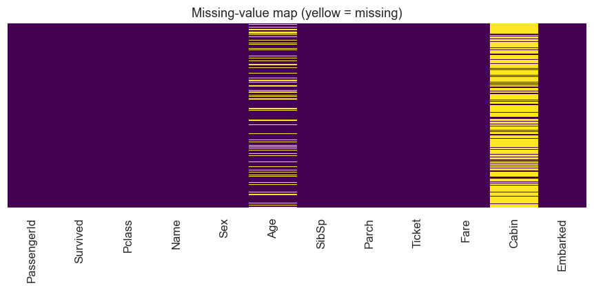
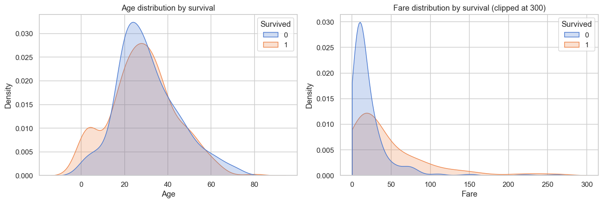
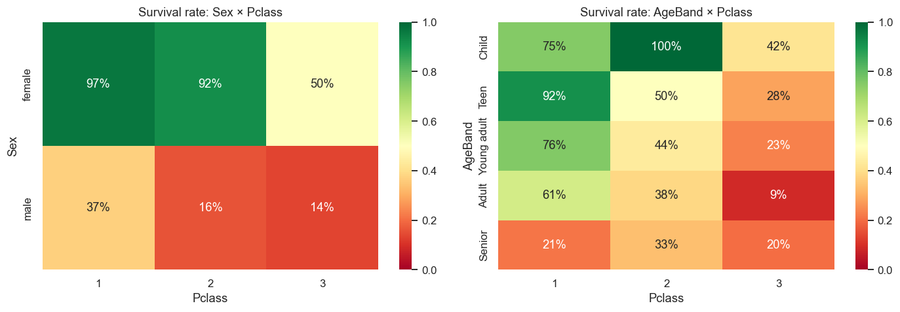
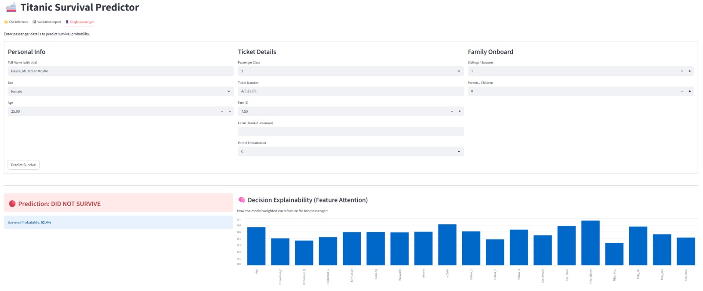

# 🚢 Titanic Survival Prediction

End-to-end ML project on the Kaggle Titanic dataset: a PyTorch **attention-gated
tabular ResNet** trained on `train.csv` alone, with a reproducible training
pipeline, shared preprocessing/evaluation modules, and an interactive Streamlit
app that explains each prediction.

The emphasis is on **design and use of AI**, not just accuracy: a non-trivial
architecture (residual blocks + a feature-attention gate), a leak-free
preprocessing pipeline shared between train and inference, and per-prediction
explainability in the UI.

## Results

Validation metrics (20% stratified hold-out, seed 42, best epoch selected on
ROC-AUC):

| Metric    | Score |
|-----------|-------|
| Accuracy  | 0.844 |
| Precision | 0.836 |
| Recall    | 0.739 |
| F1        | 0.785 |
| Macro-F1  | 0.831 |
| ROC-AUC   | 0.880 |

Decision threshold tuned by macro-F1 search (0.56). Hyperparameters come from
[best_params.json](best_params.json); full run config + metrics in
[artifacts/metadata.json](artifacts/metadata.json). Regenerate with
`python tuning.py` then `python train.py`.

## Project layout

| Path | Role |
|------|------|
| [fetch_data.py](fetch_data.py) | Idempotent Kaggle fetch of `data/train.csv` |
| [prepare_data.py](prepare_data.py) | Cache split + fitted preprocessor (for Colab GPU training) |
| [src/preprocessing.py](src/preprocessing.py) | Shared preprocessing pipeline (missing values, encoding, scaling, feature engineering) |
| [src/model.py](src/model.py) | `TabularResNet` — residual blocks + feature-attention gate |
| [tuning.py](tuning.py) | Optuna hyperparameter search → writes `best_params.json` |
| [best_params.json](best_params.json) | Committed tuned hyperparameters — the source of truth `train.py` reads |
| [train.py](train.py) | Train loop: reads `best_params.json` → split → fit preprocessor on train → early stopping → save best checkpoint |
| [src/evaluation.py](src/evaluation.py) | Shared metrics + plots (confusion matrix, ROC, learning curves) |
| [ds_app.py](ds_app.py) | Streamlit app: interactive prediction + attention-based explanation |
| [notebooks/eda.ipynb](notebooks/eda.ipynb) | EDA: distributions, missingness, survival rates, insights |
| [notebooks/colab_train.ipynb](notebooks/colab_train.ipynb) | GPU training on Colab |

Training artifacts (`model.pt`, `preprocessor.joblib`, `metadata.json`,
`history.json`) are written to `artifacts/` by default (the directory `ds_app.py`
reads from). Override with `--out-dir <path>`.

## Setup

```bash
# 1. Clone
git clone <your-repo-url>
cd IAI_TITANIC

# 2. Create + activate a virtualenv
python -m venv .venv
.venv\Scripts\activate        # Windows
# source .venv/bin/activate   # macOS/Linux

# 3. Install
pip install -r requirements.txt
```

## Data

Only `train.csv` is used (per the assignment); the train/val split is created
from it alone. A 40-row balanced [data/sample.csv](data/sample.csv) is committed
so the repo runs without Kaggle credentials.

```bash
python fetch_data.py   # downloads data/train.csv (skips if present)
```

The fetch needs Kaggle auth **and** acceptance of the competition rules at
<https://www.kaggle.com/competitions/titanic/rules> (otherwise 403).

Credentials are loaded from (in order): `.env` in the project root → shell env
vars → `~/.kaggle/kaggle.json`. Copy `.env.example` to `.env` and fill in
`KAGGLE_USERNAME` + `KAGGLE_KEY` (or `KAGGLE_API_TOKEN`).

## Train

```bash
python train.py
```

Reads `best_params.json` for hyperparameters → loads data → stratified split →
fits preprocessing on the training split only (no leakage) → trains with early
stopping → saves the best checkpoint, preprocessor and metadata to `artifacts/`,
then prints validation metrics. Explicit CLI flags override the file, which
overrides the built-in defaults.

### (Optional) Hyperparameter tuning

Tuning is split out from training as a separate, occasional step (MLOps style):

```bash
python tuning.py --n-trials 20
```

Runs an Optuna search (standalone — no Colab / `prepare_data.py` needed) and
writes the winning hyperparameters to `best_params.json`. That file is committed
to Git, so the exact configuration behind the current weights is always known;
`train.py` picks it up automatically on the next run.

## Run the app

```bash
streamlit run ds_app.py
```

Loads `artifacts/model.pt` + `preprocessor.joblib` + `metadata.json` and offers
three tabs:

1. **CSV inference** — give a path to a CSV; the app runs batch inference, shows
   a downloadable predictions table, and (when the file has a `Survived` column)
   the full evaluation: Accuracy/Precision/Recall/F1/ROC-AUC, confusion matrix
   and ROC curve.
2. **Validation report** — reproduces the exact held-out validation split from
   training and shows its metrics, plots and the learning curves.
3. **Single passenger** — an interactive form that predicts one passenger and
   shows a **feature-attention bar chart** explaining the decision.

## Reproducibility

All randomness (split, init, training) is keyed off `--seed` (default 42).
Re-running `train.py` with the same seed reproduces the split and metrics above.

## EDA Insights

Key findings from exploratory data analysis:

**Missing values:** Age (~ 19% missing) and Cabin (~ 77% missing); all other
features present. Age is imputed via median; Cabin is dropped.

**Dominant patterns:**

- **Sex × Pclass interaction**: Females (esp. 1st class) had 92–97% survival;
  males 14–37%. This is the strongest signal.
- **Child effect**: Children (esp. with the `Master` title) had 100% survival in
  1st class, ~75% in 2nd. Age <15 and family structure matter.
- **Fare gradient**: Lower fares correlate with lower survival, but within each
  class the effect is subtle.






## Design notes

- **Architecture** — The dominant signal is the Sex×Pclass interaction plus a
  non-linear child effect. A flat MLP under-fits these, so the model uses
  pre-activation residual blocks (skip connections learn interactions on top of
  an identity path) preceded by a **feature-attention gate** that both improves
  fit and doubles as the explainability signal shown in the app.
- **Shared preprocessing/evaluation** — `train.py` and `ds_app.py` import the
  same `src/preprocessing.py` and `src/evaluation.py`, so train-time and
  inference-time transforms and metrics are identical by construction.
- **No leakage** — the preprocessor is fit on the training split only and
  persisted alongside the weights.

## Streamlit App

**Interactive prediction & explanation** — The Streamlit app loads the trained
model and preprocessor, accepts a CSV or single-passenger form, and shows:

1. **CSV inference** — batch predictions, downloadable results, and (with labels)
   full evaluation metrics and ROC curve.
2. **Validation report** — exact held-out metrics from training + learning curves.
3. **Single passenger** — form-based prediction with a **feature-attention bar
   chart** explaining the decision.


